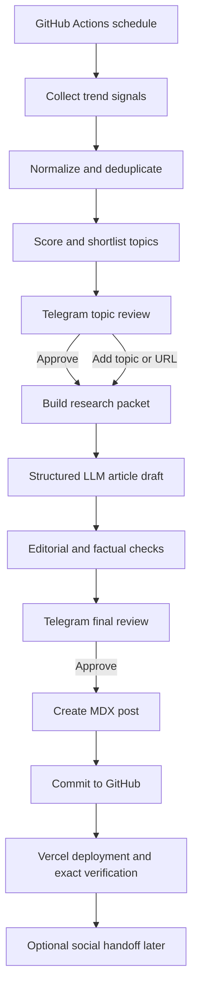

# AI Content Machine

AI Content Machine is a trend-first, human-approved publishing system for Deep's personal technology publication. It is designed to discover high-value stories, assemble source-backed research, draft articles in a consistent personal voice, request approval through Telegram, publish to a Next.js + MDX website, and prepare social content for LinkedIn, X, Instagram, and Medium.

## V1 production operation

Normal operation is Telegram-only after the one-time hosted setup. Discovery runs exactly twice per week; the hosted worker may wake every 15 minutes to reconcile durable work without creating extra discovery runs. Vercel hosts the permanent webhook, health check, and signed previews; GitHub Actions runs durable lease-based jobs; private state remains in Supabase/Postgres; and exact final approval automatically publishes to `deep8904/Deep-Blog` and verifies its Vercel production deployment. See [`docs/20_DEEP_OPERATOR_GUIDE.md`](docs/20_DEEP_OPERATOR_GUIDE.md).

Social distribution remains a separate later phase and is not part of the V1 automatic blog-publication path.

The project is intentionally designed around three constraints:

1. No additional recurring software spend beyond existing Claude and Gemini subscriptions.
2. Minimal manual work: topic approval and final content approval.
3. Quality must remain higher than generic AI-generated content.

## Core publishing model

The system does not assign fixed content categories to fixed weekdays. It searches current signals across the four configurable editorial interests—new/computer/design technology, product reviews/hardware, gaming/game design/game engines, and software/AI—then recommends the strongest opportunities available at that moment. Interests can be viewed and changed from Telegram without editing code.

A typical run is:

## Human responsibilities

Deep only performs two normal actions:

- Approve, reject, or add topics.
- Approve, edit, regenerate, or publish the final article.

The system must also allow manual topic submission by text or URL.

## Initial publishing target

- Two strong long-form articles per week by default.
- Up to four articles in unusually active news weeks.
- Social distribution one or two times per week, selected based on content strength rather than obligation.
- No publishing when no topic passes the quality threshold.

## Repository map

- `docs/`: product, architecture, research, automation, publishing, and implementation documentation.
- `brand/`: audience, writing style, editorial policy, and design system.
- `prompts/`: operational prompts for Claude and Gemini.
- `templates/`: MDX and social output templates.
- `automation/`: configuration and data contracts for the future implementation.
- `.github/workflows/`: starter workflow definitions.
- `CLAUDE.md`: day-to-day instructions for Claude Code.

## Start here

Claude Code should read these files in order:

1. `CLAUDE.md`
2. `docs/00_PROJECT_BRIEF.md`
3. `docs/01_PRODUCT_REQUIREMENTS.md`
4. `docs/02_SYSTEM_ARCHITECTURE.md`
5. `docs/03_IMPLEMENTATION_PLAN.md`
6. All files in `brand/`
7. Relevant prompts and schemas before implementing each module

## Important implementation principle

This repository is a product specification and implementation brief. Claude Code must not attempt to build every subsystem in one pass. It must implement the milestones in `docs/03_IMPLEMENTATION_PLAN.md`, validate each milestone, and preserve the approval-first publishing model.

## Development

Milestone 0 provides the Next.js and TypeScript foundation. See [`docs/09_REPOSITORY_FOUNDATION.md`](docs/09_REPOSITORY_FOUNDATION.md) for local setup, validation commands, environment configuration, and the approval-gate invariant.

Milestone 1 provides deterministic RSS, Atom, and Hacker News ingestion without AI calls. See [`docs/10_TREND_INGESTION.md`](docs/10_TREND_INGESTION.md) for configuration, CLI usage, output artifacts, error handling, and security boundaries.

Milestone 2 provides deterministic story clustering, explainable scoring, recent-topic suppression, and compact editorial packet preparation without invoking AI. See [`docs/11_STORY_CLUSTERING_AND_RANKING.md`](docs/11_STORY_CLUSTERING_AND_RANKING.md).

Milestone 3 provides the local/test Telegram topic-approval control layer, signed callbacks, authorization, safe manual URL intake, idempotent file state, and unconsumed topic-approved handoff events. See [`docs/12_TELEGRAM_TOPIC_APPROVAL.md`](docs/12_TELEGRAM_TOPIC_APPROVAL.md). Production webhook execution intentionally fails closed until a private durable state backend is selected; Vercel local disk and the public source repository are not used for private approval state.

Milestone 4 provides deterministic source retrieval, safe extraction, evidence and conflict mapping, explainable research sufficiency, immutable research packets, and a manual Claude Code/Gemini assistance round-trip without AI SDKs or unattended model calls. See [`docs/13_RESEARCH_PACKET_PIPELINE.md`](docs/13_RESEARCH_PACKET_PIPELINE.md). It stops before article drafting and preserves both Telegram approval gates.

Milestone 5 provides explicit-version writing eligibility, bounded manual Claude Code task generation, strict source-linked imports, safe MDX/frontmatter validation, deterministic quality reporting, history checks, and immutable draft persistence. See [`docs/14_ARTICLE_WRITING_PIPELINE.md`](docs/14_ARTICLE_WRITING_PIPELINE.md). Drafts remain unapproved; final Telegram review, publishing, social content, images, and analytics are intentionally not implemented.

Milestone 6 provides deterministic and manual Claude Code editorial review, immutable targeted revisions, a private local preview, and the mandatory Telegram final-article gate. Approval creates an exact-version, unconsumed handoff event and stops before publication. See [`docs/15_EDITORIAL_REVIEW_AND_FINAL_APPROVAL.md`](docs/15_EDITORIAL_REVIEW_AND_FINAL_APPROVAL.md).

Milestone 7 provides exact-event publication, public-safe MDX citation finalization, one-commit repository adapters, deployment verification policies, and sidecar consumption. It stops before social generation. See [`docs/16_PUBLICATION_PIPELINE.md`](docs/16_PUBLICATION_PIPELINE.md).

Milestone 8 provides exact-publication social task preparation, strict manual Claude Code/Gemini import, platform quality reports, immutable package versions, per-item Telegram approval/scheduling/revision controls, public-safe exports, and manual posted records. It never invokes a model or posts automatically. See [`docs/17_SOCIAL_CONTENT_PIPELINE.md`](docs/17_SOCIAL_CONTENT_PIPELINE.md).

Milestone 9 completes the roadmap with privacy-safe aggregate analytics, strict manual imports, provider-neutral boundaries, null-safe snapshots, deterministic reports and insights, manual assisted-analysis packets, and aggregate Telegram review. It never identifies visitors, calls a model, changes ranking/editorial configuration, or bypasses either Telegram approval gate. The optional dashboard is disabled; production fails closed until private durable storage exists. See [`docs/18_ANALYTICS_AND_FEEDBACK_LOOP.md`](docs/18_ANALYTICS_AND_FEEDBACK_LOOP.md) and [`docs/19_END_TO_END_OPERATIONS.md`](docs/19_END_TO_END_OPERATIONS.md).

For day-to-day operation, production blockers, and literal command sequences, use [`docs/20_DEEP_OPERATOR_GUIDE.md`](docs/20_DEEP_OPERATOR_GUIDE.md), [`docs/21_PRODUCTION_SETUP_CHECKLIST.md`](docs/21_PRODUCTION_SETUP_CHECKLIST.md), and [`docs/22_DAILY_COMMAND_CHEATSHEET.md`](docs/22_DAILY_COMMAND_CHEATSHEET.md). The operator guide audits the current implementation and explicitly identifies stale or aspirational commands in older documentation.

## Durable Postgres storage

Provider-neutral Postgres adapters, 10 ordered migrations, fail-closed repository composition, database/readiness CLIs, and file migration tooling are implemented. File repositories remain the development/fixture default. Code availability is `DATABASE_CODE_READY`; it is not evidence that a real Supabase project is connected, migrated, parity-verified, staged, or production-ready.

Start with [`docs/23_DURABLE_STORAGE_ARCHITECTURE.md`](docs/23_DURABLE_STORAGE_ARCHITECTURE.md), [`docs/25_SUPABASE_SETUP.md`](docs/25_SUPABASE_SETUP.md), and [`docs/26_DEEP_SUPABASE_HANDOFF.md`](docs/26_DEEP_SUPABASE_HANDOFF.md). Production requires `STORAGE_BACKEND=postgres` and a live passing database capability check. The private `content_machine` schema must never be exposed through browser/Data API schemas. Both Telegram approval gates remain mandatory.
