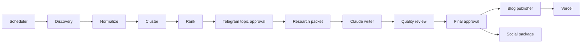
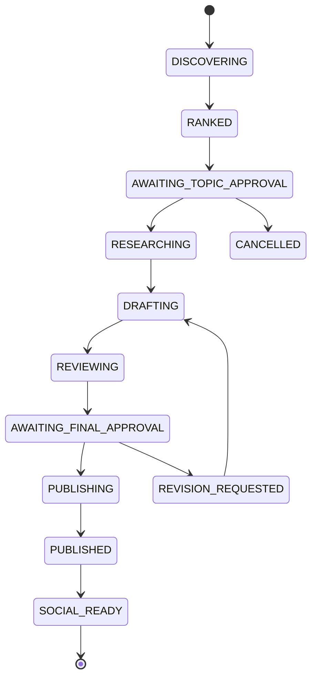

# System Architecture

Milestone 6 extends the private pipeline through deterministic/manual editorial review, immutable revision, and a second Telegram approval gate. Its terminal artifact is an unconsumed `ArticleFinalApprovedEvent`; publication remains outside the boundary. Local file repositories fail closed in production until private durable storage exists. See [the Milestone 6 architecture](15_EDITORIAL_REVIEW_AND_FINAL_APPROVAL.md).

## 1. Architectural style

The system uses a staged pipeline with persistent artifacts. Each stage consumes a defined input, writes a defined output, and can be rerun safely. The architecture avoids a single large agent that browses, reasons, writes, and publishes in one uncontrolled step.

## 2. Main components

### Scheduler

On the free hosted V1, GitHub Actions is the primary scheduler, reconciler, and worker. It runs the durable worker every 15 minutes and also supports manual dispatch. A repository-level concurrency group prevents overlapping runs. Each invocation reconciles durable Postgres jobs before draining them and records scheduler/worker heartbeats.

Reconciliation resolves only two UTC discovery slots per week: Monday and Thursday at 16:00 UTC. Repeated 15-minute worker runs reuse the slot's deterministic idempotency key, so they cannot create extra discovery runs. Each successful run durably records its window end; the next run starts at that boundary and ends at the current slot, preventing gaps and overlaps. A first run bootstraps from the preceding seven days.

### Discovery service

Responsibilities:

- Fetch feeds and public APIs.
- Respect timeouts and source limits.
- Parse feed formats.
- Normalize timestamps.
- Save raw items.
- Record source failures.

Discovery does not call Claude.

### Story clustering service

Responsibilities:

- Canonicalize URLs.
- Match exact titles after normalization.
- Detect similar titles.
- Group items sharing named entities and event phrases.
- Preserve source diversity.

Use deterministic heuristics first. A small AI classification call may resolve uncertain clusters in batches.

### Ranking service

Ranking has two layers:

1. Deterministic score from freshness, source count, authority, and discussion data.
2. AI editorial score for relevance, angle strength, and shelf life.

Only the top deterministic candidates should be sent to AI.

The four initial editorial interests and their keyword weights live in durable Postgres state. Telegram commands can add, enable, disable, or remove interests; every change is recorded in an append-only audit table. Enabled interests influence ranking without weakening freshness, evidence, deduplication, or quality thresholds.

### Telegram gateway

The Telegram bot is the operator interface. It should use inline keyboards for common actions and commands for advanced actions.

Topic callbacks must carry stable IDs, not the entire topic payload.

### Research orchestrator

The research orchestrator retrieves the approved topic cluster, selects the best sources, extracts content where permitted, and creates a structured evidence packet.

Milestone 4 implements this as deterministic local repositories and a manual assisted-import boundary. Approval events remain immutable; separate claim/consumption state is written only after immutable packet and index persistence. Production research remains disabled until a private durable repository adapter is configured. No article writer or model SDK is part of this stage.

Recommended source priority:

1. Official announcement, documentation, release notes, filing, repository, or product page.
2. High-quality independent technical reporting.
3. Specialist analysis.
4. Community discussion.
5. Aggregated reporting only when better sources are unavailable.

### Writer

Claude receives only:

- The approved topic record.
- A compact research packet.
- Relevant brand rules.
- Relevant article template.
- Explicit output schema.

Claude should not receive hundreds of raw articles.

### Reviewer

The reviewer uses a separate prompt and should not be told to preserve every sentence. It validates claims against the packet, flags unsupported statements, and proposes bounded edits.

### Publisher

The publisher validates frontmatter and MDX, writes content to the blog repository, commits, and records the result.

### Social packager

Gemini is preferred for social transformations and image generation prompts. It consumes the approved final article, not raw research.

## 3. State model

Recommended initial storage is file-based JSON committed or cached by workflow artifacts. Avoid adding a database until concurrency or dashboard requirements justify it.

Core records:

- `Run`
- `SourceItem`
- `StoryCluster`
- `TopicCandidate`
- `Approval`
- `ResearchPacket`
- `ArticleDraft`
- `ReviewReport`
- `Publication`
- `SocialPackage`

## 4. Run lifecycle

## 5. Deployment architecture

### GitHub Actions

Runs the frequent scheduler/reconciler/worker loop. The runner filesystem is temporary; Postgres is the only durable queue and state store. GitHub Actions is not used for receiving Telegram webhooks continuously.

### Vercel Hobby

Hosts the stable Telegram webhook, health endpoint, signed previews, and authenticated HTTP control routes. No Vercel-native cron is required, so the V1 architecture does not require a Pro plan. `/api/cron/reconcile` remains available as an authenticated recovery/control endpoint but is not part of normal scheduling.

### Telegram interaction options

#### Option A: Vercel serverless endpoint

Recommended for the bot webhook because the blog already uses Vercel.

- Telegram sends callback updates to a Next.js API route.
- The route verifies the bot secret.
- The route writes an approval file through GitHub API or triggers a repository dispatch workflow.
- GitHub Actions resumes the pipeline.

Milestone 3 implements the endpoint and provider-neutral persistence boundary, but production execution currently fails closed: Vercel local disk is not durable and this public repository cannot safely store private Telegram approval state. A private durable adapter must be selected before deployment. Local file persistence remains limited to development and tests.

#### Option B: Polling inside scheduled workflows

Simpler but less responsive. A scheduled workflow checks Telegram updates and processes commands. This may be acceptable for an MVP but is not ideal for reliable callback buttons.

## 6. Provider abstraction

Define interfaces:

- `TrendSourceAdapter`
- `ContentExtractor`
- `LanguageModel`
- `ImageGenerator`
- `NotificationAdapter`
- `ContentPublisher`

This prevents the codebase from depending directly on one AI or source.

Milestone 5 adds provider-neutral writing repositories and an `ArticleWriterProvider` boundary, but wires no provider. Local preparation pins one approved, ready research-packet version and produces a bounded Claude Code task. Strict import validation then persists an immutable, unapproved draft. Production writing remains fail-closed until private durable storage exists; final Telegram article approval and all publishing stay downstream and unimplemented.

Milestone 8 adds provider-neutral social repositories plus unwired `SocialGeneratorProvider` and `SocialPublisher` boundaries. The implementation consumes an exact verified publication blob, creates compact manual-generation tasks, validates immutable platform packages, and gates exports through per-item Telegram approval. Scheduling is a private note and manual posting is the default. No model, image generator, platform API, or analytics adapter is wired.

Milestone 9 adds a separate private analytics boundary after publication/social records. Provider-neutral adapters and strict aggregate imports feed immutable metrics, snapshots, insights, reports, and assisted-analysis tasks. Telegram exposes bounded aggregates and human insight decisions. Analytics has no write path into ranking, editorial policy, approvals, publication, or social generation. Local adapters fail closed in production; no public dashboard is enabled.

## 7. Failure handling

- Discovery source failure: continue and log.
- Primary source unavailable: do not write unless evidence remains sufficient.
- AI invalid JSON: retry once with schema correction.
- Research below threshold: return topic to Telegram with explanation.
- MDX validation failure: block publication.
- GitHub write conflict: fetch latest state, rebase the article operation, retry once.
- Vercel failure: leave publication marked `DEPLOY_FAILED` and notify the user.

## 8. Observability

Every log event should include:

- `timestamp`
- `level`
- `runId`
- `stage`
- `topicId`
- `articleId`
- `provider`
- `durationMs`
- `attempt`
- `message`

Metrics worth retaining:

- Candidates collected.
- Clusters created.
- Topic approval rate.
- Research source count.
- AI calls and approximate tokens.
- Draft revision count.
- Publishing success rate.
- Time from discovery to publication.
